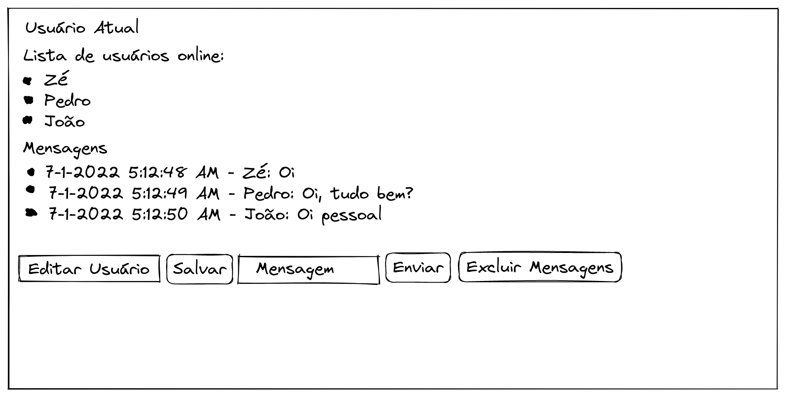

# Projeto WebChat

---

## [Clique aqui para acessar a aplicação](https://webchat-victor.herokuapp.com/)

---

# Habilidades Trabalhadas

- Desenvolvimento de um server socket usando o socket.io;

- Emissão de eventos personalizados usando o socket.io;

- Uso do pacote `socket.io` do Node.js para criar aplicações que trafeguem mensagens através de sockets.

---

# O que foi desenvolvido
Um _chat_ online que ao ser utilizado o usuário é capaz de:

 - Usar o front-end para enviar mensagens a clientes conectados;
 - Visualizar o histórico de mensagens da conversa;
 - Visualizar os usuários online no momento;
 - Alterar o nome de usuário no chat em tempo real;

---

# Detalhes da implementação

 - O MVC será usado para renderizar as mensagens do histórico e usuários online, com ambos vindo direto do servidor;
 - Ao acessar o link do projeto hospedado é provável que seja preciso esperar alguns instantes, pois a aplicação é suspensa ao ficar um tempo sem ser acessa e precisa desse tempo para ser ativada novamente.
 - O horário das mensagens que a aplicação provém é o horário UTC, ou seja, o fuso horário não está personalizado.
